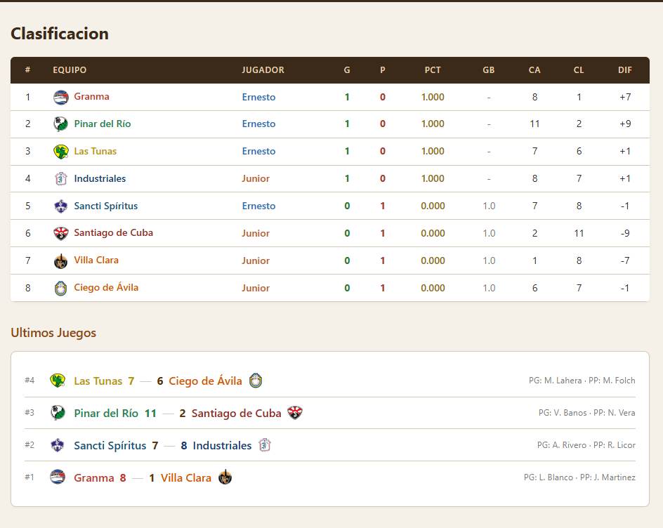
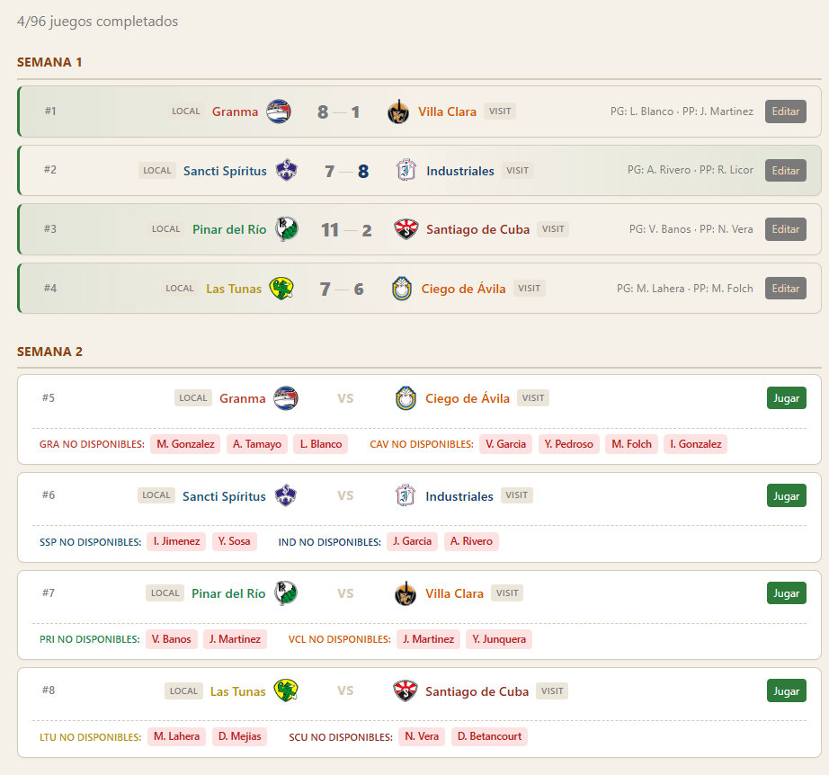
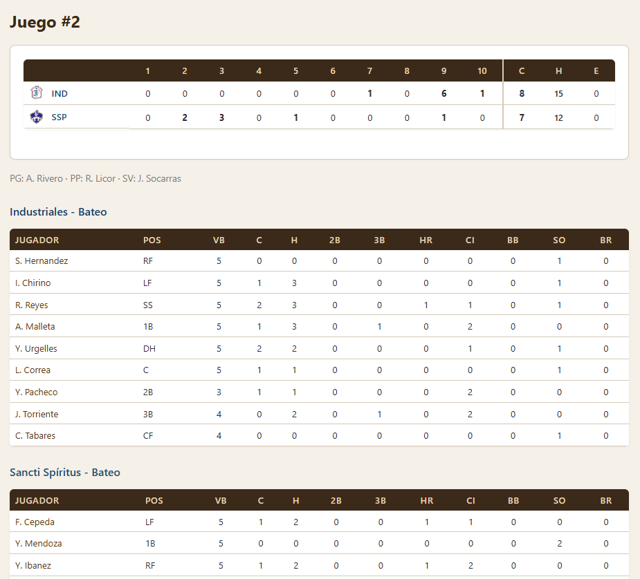
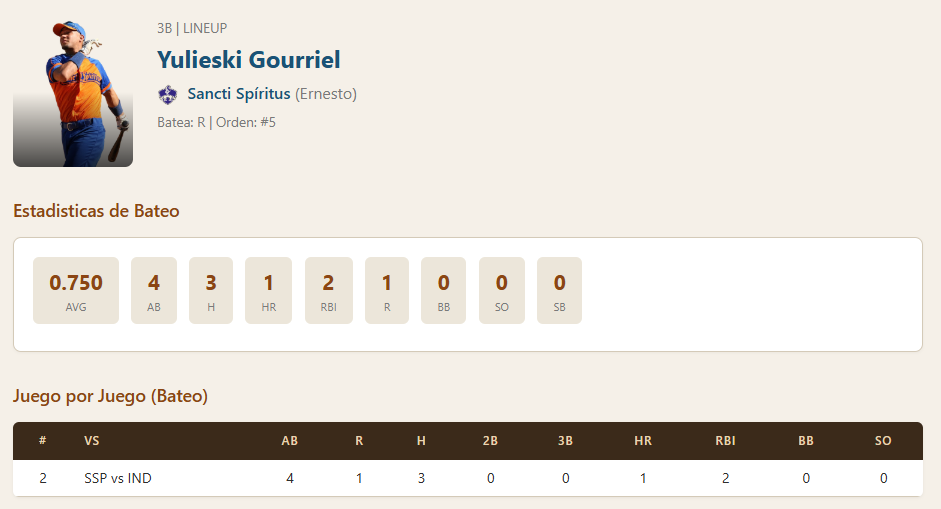
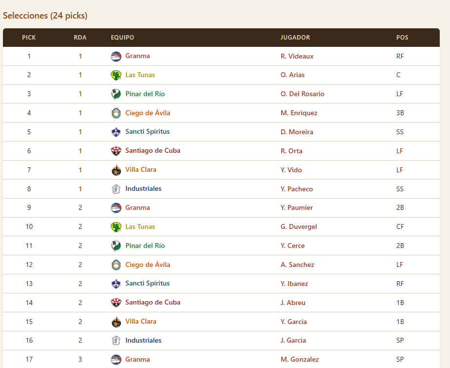
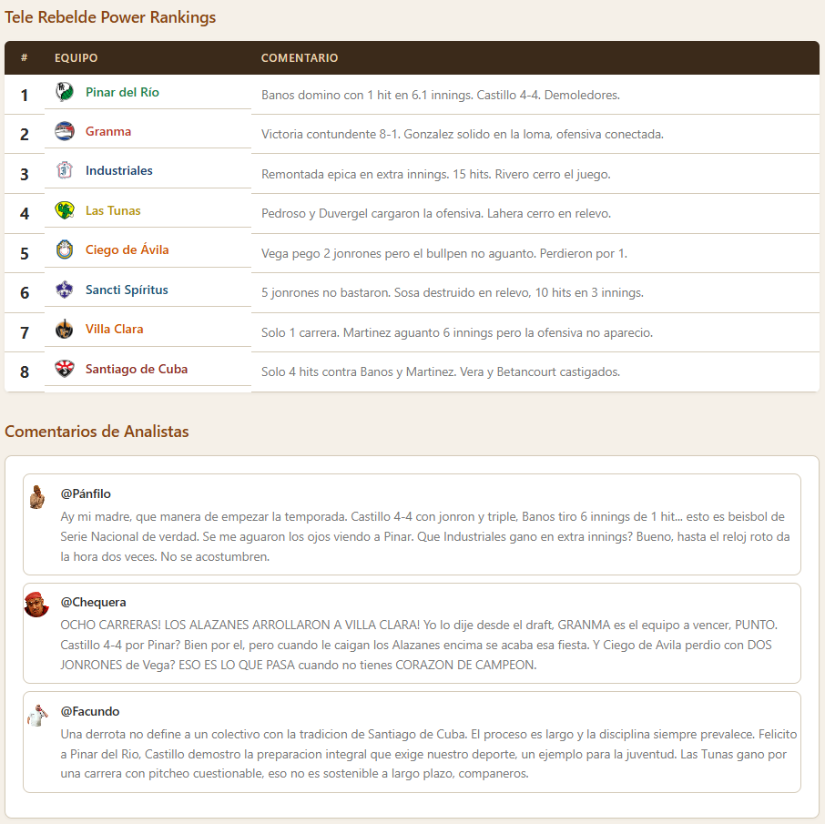

# Serie Nacional de Baseball - MVP Cuba 2011

Aplicacion web para seguir un torneo simulado de la Serie Nacional de Baseball de Cuba, jugado en **MVP Baseball 2005**. Dos duenos (Ernesto y Junior) controlan 4 equipos cada uno a traves de una temporada regular de 96 juegos, playoffs y mas.



## Funcionalidades

- **Clasificacion** — Tabla de posiciones en tiempo real con juegos recientes
- **Calendario** — Programacion completa de 96 juegos con resultados y lanzadores
- **Box Score** — Estadisticas detalladas por jugador para cada juego (bateo y pitcheo)
- **Jugadores** — Perfiles individuales con foto, atributos, estadisticas acumuladas y juego por juego
- **Draft** — Sistema de draft de 3 rondas (24 selecciones) con ranking de equipos
- **Playoffs** — Bracket de semifinales y final (series al mejor de 5)
- **Lideres** — Lideres estadisticos de bateo (AVG, HR, CI) y pitcheo (ERA, SO, PCL)
- **Antesala** — Show pre-juego con 4 analistas, predicciones y comentarios
- **Resumen Semanal** — Jugador de la semana, Power Rankings de Tele Rebelde y tweets de analistas

## Capturas

| Calendario | Box Score |
|:---:|:---:|
|  |  |

| Jugador | Draft |
|:---:|:---:|
|  |  |

| Resumen Semanal |
|:---:|
|  |

## Equipos

| Equipo | Dueno |
|--------|-------|
| Granma | Ernesto |
| Sancti Spiritus | Ernesto |
| Pinar del Rio | Ernesto |
| Las Tunas | Ernesto |
| Santiago de Cuba | Junior |
| Villa Clara | Junior |
| Industriales | Junior |
| Ciego de Avila | Junior |

## Stack

- **Flask** con patron app factory y Blueprints
- **SQLite** con modo WAL (sin ORM, consultas SQL directas)
- **Jinja2** con macros reutilizables como componentes
- **CSS** puro con variables CSS (sin frameworks)
- **Python 3**

## Ejecutar localmente

```bash
pip install flask openpyxl
python app.py
```

La app corre en `http://localhost:5000`

## Docker

```bash
docker compose up -d
```

La base de datos se persiste en el volumen `./data/`. Copiar `torneo.db` a esa carpeta antes del primer arranque.

## Estructura del proyecto

```
├── app.py                  # Factory de la app Flask
├── config.py               # Configuracion por entorno
├── db.py                   # Conexion SQLite (WAL, foreign keys)
├── blueprints/             # 10 blueprints (main, teams, players, etc.)
├── services/               # Logica compartida (standings, weekly)
├── templates/              # Jinja2 con componentes reutilizables
├── static/                 # CSS y graficos (logos, fotos)
├── schema.sql              # DDL de referencia
├── Dockerfile              # Imagen de produccion
└── docker-compose.yml      # Deploy con volumen para DB
```
